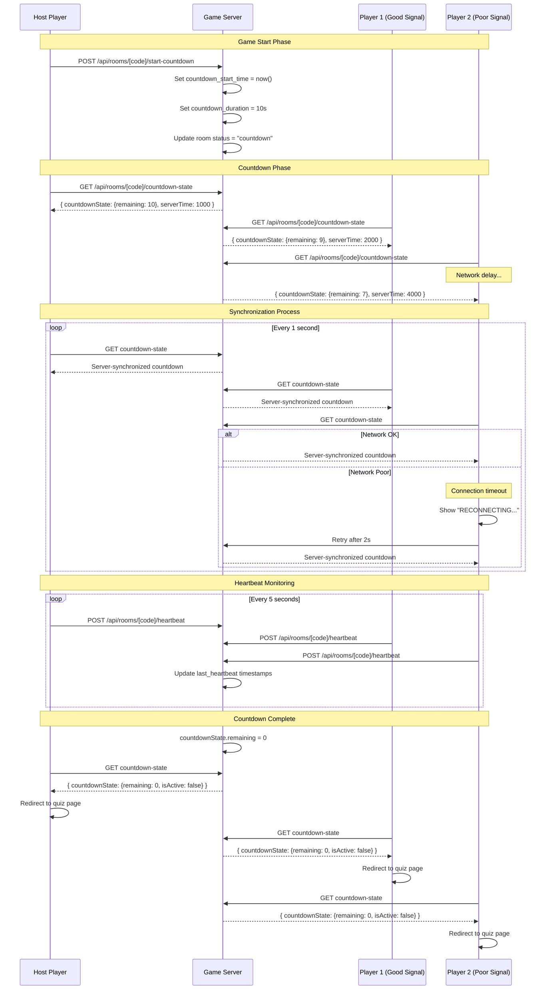

# Countdown Synchronization Flow Diagram

## Key Features Illustrated:

1. **Server Authority**: Server adalah sumber kebenaran tunggal untuk waktu countdown
2. **Network Resilience**: Player dengan sinyal jelek tetap mendapat countdown yang sinkron
3. **Automatic Reconnection**: Player2 otomatis reconnect jika koneksi terputus
4. **Heartbeat Monitoring**: Server memantau status koneksi semua player
5. **Synchronized Completion**: Semua player selesai countdown pada waktu yang sama

## Benefits:

- ✅ **Consistent Timing**: Semua player melihat countdown yang sama
- ✅ **Network Tolerance**: Bekerja meskipun ada masalah koneksi
- ✅ **Real-time Sync**: Update setiap detik dengan sinkronisasi server
- ✅ **User Feedback**: Indikator koneksi yang jelas
- ✅ **Auto Recovery**: Otomatis reconnect tanpa intervensi user
